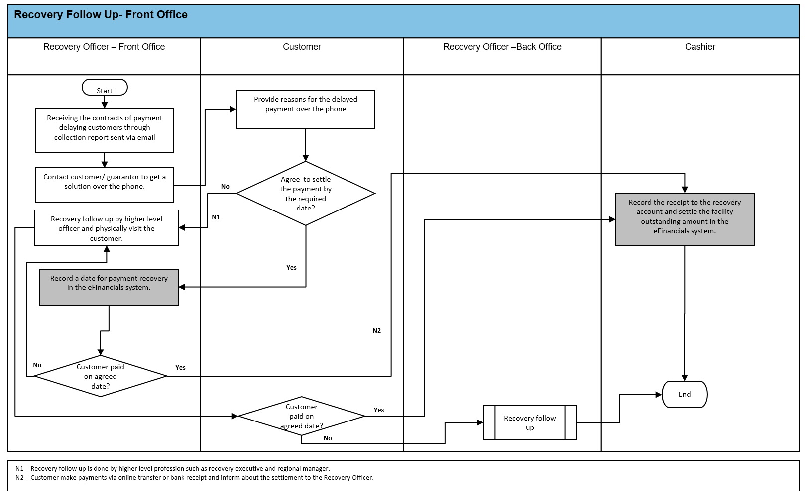

# Laminar

**Business Process Analysis and Visualization Tool**

Laminar converts Excel spreadsheets containing business process descriptions into interactive Mermaid flowchart diagrams.



## Features

- **Smart Extraction**: Two-stage approach for optimal results
  - **Template Parser**: Fast, free parsing for compliant Excel files
  - **AI Fallback**: Claude AI for complex/non-standard files
- **No Docker Required**: Pure Python implementation (Docker optional for legacy mode)
- **Professional Diagrams**: Mermaid flowcharts with swimlanes, color-coded paths
- **Batch Processing**: Process multiple sheets/files at once
- **GUI & CLI**: Desktop application and command-line interface

## Installation

### Prerequisites

- Python 3.10+
- Anthropic API key (only needed for AI fallback)

### Install from source

```bash
# Clone the repository
git clone https://github.com/asemiya/laminar.git
cd laminar

# Create virtual environment
python -m venv .venv
source .venv/bin/activate  # Windows: .venv\Scripts\activate

# Install the package
pip install -e .
```

## Quick Start

```bash
# Process an Excel file (auto-detects best method)
laminar process.xlsx

# Force template-only mode (no API needed)
laminar process.xlsx --force-template

# Force AI mode (requires API key)
laminar process.xlsx --force-ai
```

## Excel Template Format

For best results (fast, free, no API needed), structure your Excel file like this:

| Step # | Role | Step Title | Description | Next Step | Condition? | Yes→ | No→ | Notes |
|--------|------|------------|-------------|-----------|------------|------|-----|-------|
| 1 | Officer | Receive report | Get customer list | 2 | | | | |
| 2 | Officer | Review data | Check completeness | 3 | | | | |
| 3 | | Data complete? | | | Yes | 4 | 2 | Decision |
| 4 | Manager | Approve | Final approval | 5 | | | | |
| 5 | | Approved? | | | Yes | END | 6 | |
| 6 | Officer | Revise | Make corrections | 3 | | | | |

### Required Columns

| Column | Aliases | Description |
|--------|---------|-------------|
| **Step #** | step, id, no | Unique step identifier |
| **Role** | actor, responsible, owner | Who performs this step |
| **Step Title** | title, name, action | Short description of the step |

### Optional Columns

| Column | Aliases | Description |
|--------|---------|-------------|
| Description | desc, details | Detailed step description |
| Next Step | next, goes to, -> | Next step for sequential flow |
| Condition? | decision, is condition | Mark "Yes" for decision points |
| Yes→ | yes next, if yes | Next step when condition is true |
| No→ | no next, if no | Next step when condition is false |
| Notes | comments, remarks | Additional information |

### Special Values

- `END` - Process completion (success)
- `ABORT` - Process termination (failure/rejection)
- `START` - Process start (auto-detected if not specified)

### Tips

- Leave **Role** empty for decision/condition steps
- Steps ending with `?` are auto-detected as conditions
- Use step numbers or titles in Next Step columns
- Conditions are auto-detected if Yes→ or No→ have values

## Configuration

### Environment Variables

Create a `.env` file (only needed for AI fallback):

```bash
cp .env.example .env
```

```env
# Only required if using AI fallback
LAMINAR_ANTHROPIC_API_KEY=your-api-key-here

# Optional settings
LAMINAR_CLAUDE_MODEL=claude-sonnet-4-20250514
LAMINAR_OUTPUT_DIR=output
LAMINAR_LOG_LEVEL=INFO
```

## Usage

### Command Line

```bash
# Auto mode (template first, AI fallback)
laminar process.xlsx

# Template only (fast, free, fails if not compliant)
laminar process.xlsx --force-template

# AI only (flexible, requires API key)
laminar process.xlsx --force-ai

# Specific sheet
laminar process.xlsx --sheet "Sheet1"

# Custom output directory
laminar process.xlsx -o ./diagrams

# Verbose output
laminar process.xlsx -v
```

### GUI

```bash
laminar-gui
```

## Output

For each Excel sheet, Laminar generates:

1. **`{sheet}_process.json`** - Structured process data
2. **`{sheet}_flowchart.mmd`** - Mermaid diagram

### Viewing Diagrams

- [Mermaid Live Editor](https://mermaid.live/)
- VS Code with Mermaid extension
- GitHub/GitLab markdown preview

## How It Works

```
Excel File
    │
    ▼
┌─────────────────────┐
│  Template Validator │ ◄── Check if file matches expected format
└─────────────────────┘
    │
    ├─── Compliant (>70% confidence)
    │         │
    │         ▼
    │   ┌─────────────────┐
    │   │ Template Parser │ ◄── Fast, free, deterministic
    │   └─────────────────┘
    │
    └─── Not Compliant
              │
              ▼
        ┌─────────────┐
        │ Claude AI   │ ◄── Flexible, handles any format
        └─────────────┘
              │
              ▼
        ┌─────────────┐
        │   Process   │ ◄── Unified data model
        └─────────────┘
              │
              ▼
        ┌─────────────┐
        │   Mermaid   │ ◄── Generate flowchart
        └─────────────┘
```

## Project Structure

```
src/laminar/
├── cli.py                    # Command-line interface
├── config.py                 # Configuration management
├── core/
│   ├── constants.py          # Enums and constants
│   ├── models.py             # Data models (Process, Role, Step)
│   └── template.py           # Template schema definition
├── services/
│   ├── process_extractor.py  # Main extraction orchestrator
│   ├── template_parser.py    # Direct template parsing
│   ├── ai_analyzer.py        # Claude AI integration
│   ├── excel_processor.py    # Excel/CSV processing
│   └── mermaid_generator.py  # Diagram generation
├── ui/
│   └── app.py                # Tkinter GUI
└── utils/
    ├── image.py              # Image utilities
    └── logging.py            # Logging setup
```

## Development

```bash
# Install dev dependencies
pip install -e ".[dev]"

# Run tests
pytest

# Type checking
mypy src/laminar

# Linting
ruff check src/laminar
```

## License

MIT License - see [LICENSE](LICENSE)

## Author

Aswin Semiya
